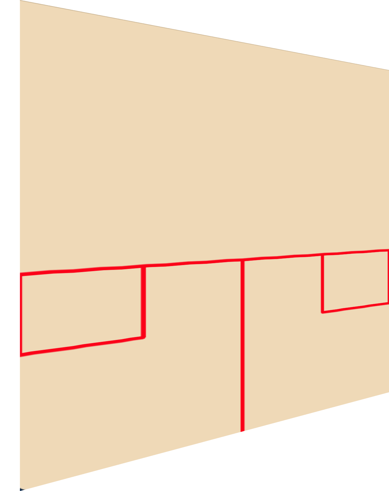

 <h1> Squash Drive Analyser </h1> 

## Basic Overview
Use videos of yourself hitting straight drives and automatically collect accuracy data from a session.
Save the data and track progress over time!

## Usage

<video width="640" height="360" controls>
  <source title="Usage demostration video" src="./resources/demo.mp4" type="video/mp4">
</video>

See **[here](./resources/HOWTO.md)** for a detailed written how-to instructions in case of uncertainty.

## Analysis accuracy
The software relies on the user to mark the service box and the rear boundary of the court and uses these as parameters for computing the ball bounce location. Therefore, it is advisable to place all markers as accurately as possible.

## Camera placement
* The video must be captured from behind the court
* The camera must be static during the video

## Timetable

| Date               |Milestone                  |Method of presentation                |Status                     |
|----------------|-------------------------------|--------------------------------------|-------------------------|
|~~01/05/2021~~  	| ~~GUI file selection~~                                   |~~Code in repository~~     |✅         |                    
|~~01/06/2021~~		| ~~Complete implementation of pre-processing stage~~      | ~~Code in repository~~    |✅         |
|~~01/07/2021~~     | ~~Complete implementation of ball detection stage~~  | ~~Code in repository~~    |✅         |
|~~01/08/2021~~		| ~~Complete implementation of ball tracking stage~~   | ~~Code in repository~~    |✅         |
|~~01/09/2021~~		| ~~Complete implementation of bounce detection~~      | ~~Code in repository~~    |✅         |
|~~14/09/2021	~~		| ~~Implemented outputs of the application~| Presentation              |           |
|20/09/2021		 | Final version						                    | Demonstration             |           |

