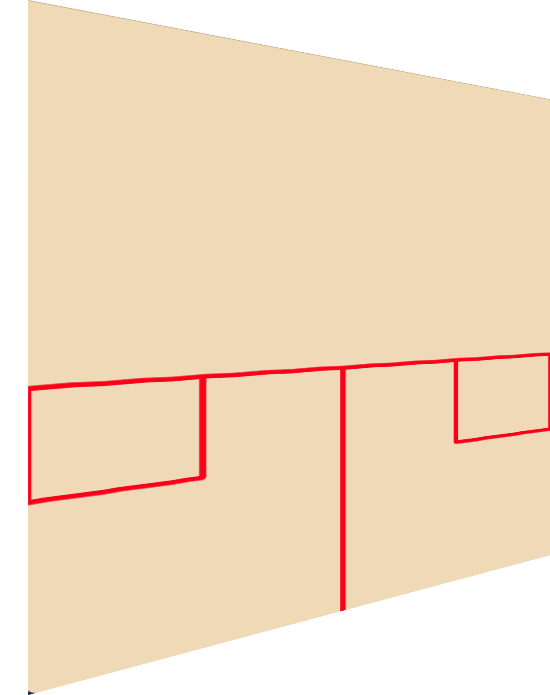

<center> <h1> Squash Drive Analyser </h1> </center>

<p align="center"></p>


## A detailed how-to:
The software allows the user to load a previously captured video run the analysis program on the video. Upon completion of the analysis, the user will receive:

* A heat-map image of the ball bounce locations.
* Ball bounce location in percentages and absolute numbers with respect to target boxes.

### How to launch
**Pre-requisite:** Download and install [Python3](https://www.python.org/downloads/)
1. Clone or download this repository
2. Create a virtual environment:
```bash
python3 -m venv venv
source venv/bin/activate
```
4. Install the required packages:
```bash
cd squash_drive_analyst
pip3 install -r requirements.txt
```
5. Launch using:
```bash
python3 main.py
```


</br>
### Video selection

The program starts with a file selection screen which allows to navigate the file system and select a video to run the program on.

_Tip_: A lower resolution video can be processed faster.

</br>

### Setting up


The set-up screen features the following elements:

* A preview frame on the left to mark the service box and the lower boundary of the court
* A zoomed-in view of the mouse cursor on the right
* An Undo button to undo last marker placement
* A checkbox that selects whether the video will be displayed during analysis or not
* Two radio-buttons marking on which side of the court the service box lies

The set-up requires that first the four corners of the service box be marked and then the two remaining points lying on the lower boundary of the court from the view of the camera.

The application will try to infer on which side of the court the marked service box lies on and automatically selects the corresponding radio-button. If the inference is incorrect then it can be manually overriden by selecting the opposite radio-button.

_Tip_: Uncheck the "Show processing video" checkbox for the analsys to run much faster.

#### Marking the service box


It is advisable to aim for the outer edges of the corners of the service box. A visual overlay is automatically drawn that connects the clicked points. The application can be seen to have correctly inferred that the service box lies on the right side of the court by the active radio-button in the lower-right corner of the application.


#### Marking the lower boundary of the court


Next any two points must be clicked on that lie on the boundary of the playing area and the floor. In the example image the points have been chosen as far apart as possible for visualization purposes.

Once the points lower boundary has been clicked a pop-up window emerges.</br>
In case the last click was not placed correctly it is possible to click "Cancel" followed by the "Undo" button to readjust the selection.</br>
To proceed into the the analysis click "Ok".


#### Processing view


If the "Show processing video" option is selected then the video is shown in parallel with generating the bounce-marks.</br>
A progress bar is also shown below to gauge the process of the analysis.

#### Output view


